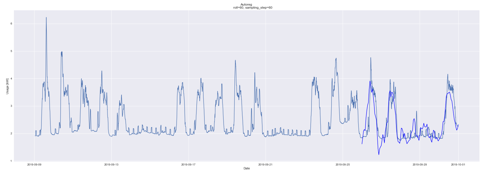
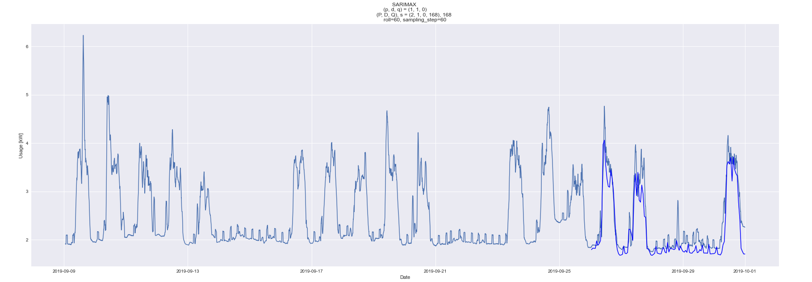
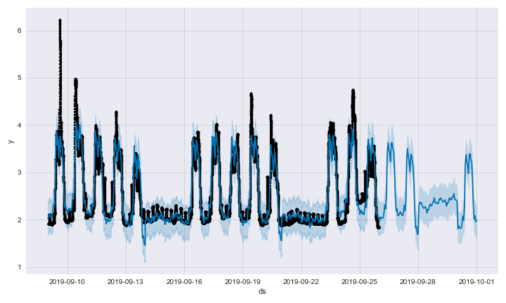

# Drahi X-Novation Center Power Consumption Forecast

Power consumption forecasting plays a key role in the energy sector for adapting the power supply to the demand. The rise of renewable energies, whose main disadvantage lies in their intermittence, makes forecasting even more important. At a smaller scale, power consumption forecasting is crucial in areas that have their own source of energy, such as local solar panels. 

In this project, **we forecast the power consumption of Ecole Polytechnique's startup incubator bulding**, the Drahi X-Novation Center, on the basis of past measurements and exogenous meteorological data. We use linear models such as ARIMA and Prophet, that provide good results for prediction horizons going from hours to 5 days.

## Results Summarized

*For a detailled explanation of the project, the models used and the results, please refer to the PDF report in the repo.*

The table below summarizes the metrics (mean absolute error and mean squared error) obtained with 3 models, using different parameters and with or without using exogeneous variables like the weather.  The parameters used for SARIMAX are $(1,1,0)(2,1,0)$.

| Model | MAE | MSE |
|---|---|---|
|AR(24) | 0.59 | 0.52 |
|AR(96) | 0.45 | 0.35 |
|**AR(96), exog.** | **0.34** | **0.27** |
|ARIMA(1,1,0) | 0.57 | 0.53 | 
|SARIMAX, $s$=24 | 0.65 | 0.71 | 
|SARIMAX, $s$=24, exog. | 1.01 | 1.61 |
|**SARIMAX, $s$=168** | **0.28** | **0.20** | 
|SARIMAX, $s$=168, exog.  | 0.41 | 0.32 |
|Prophet | 0.36 | 0.25 |
|Prophet, exog. | 0.31 | 0.21 |
|**Prophet, exog., weekend seasonality** | **0.27** | **0.18** |

Below are the prevision plots of the three best performing models (in bold on the previous table). 







## Requirements

- fbprophet=0.4
- matplotlib=2.2.2
- numpy=1.19.5
- pandas=0.25.0
- pystan=2.17.1.0
- scikit-learn=0.20.1
- scipy=1.1.0
- seaborn=0.7.1
- statsmodels=0.12.2

## Models

- Autoregressive model
- ARIMA
- SARIMAX
- Prophet

## Dataset

```All_data_zone2.csv```

## Python scripts
- ```preprocessing_utils.py``` contains a preprocessing function for the dataset
- ```plot_utils.py``` contains all the plot functinos used in the project
- ```evaluation.py``` contains the main evaluation function
- ```predictor_functs``` contains the prediction functions. Ther is one function for per model, each of which can be parametrized
- ```main.py``` is a notebook-like Python script. All the results obtained in the report are accessible frm this file.

## Quick start
- Place the file ```All_data_zone2.csv``` in the current directory.
- Execute the importation and the preprocessing cells.
- Execute one of the following cells to:
  - plot the time series,
  - plot the correlation matrix,
  - fit, predict, plot and asses each model.
